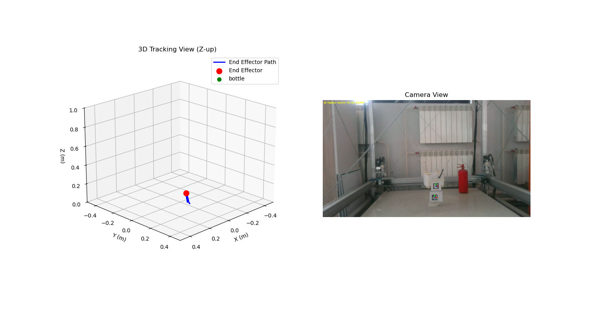
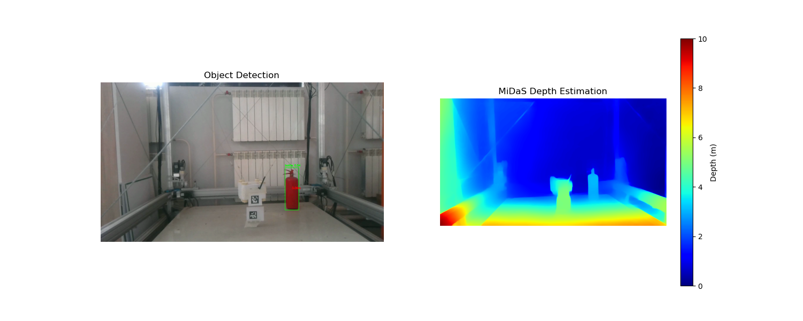

# Cable-Driven Parallel Robot (CDPR) Vision System

This repository contains computer vision tools for tracking and collision avoidance in cable-driven parallel robots. The system provides real-time object detection, depth estimation, and 3D visualization of the robot's workspace.

## System Overview


The vision system performs three main functions:
1. Camera calibration and ArUco marker tracking
2. Object detection and 3D localization
3. Real-time 3D visualization of robot and objects

## Key Components

### 1. Camera Calibration (`cv/camera_calibration.py`)
- Calculates intrinsic camera parameters and distortion coefficients
- Uses checkerboard pattern for calibration
- Saves calibration data in `.npz` format for other modules

### 2. End Effector Tracking (`cv/ee_position_recorder.py`)
- Tracks ArUco markers on robot base and end effector
- Records positions in CSV format for analysis
- Calculates relative position and orientation

### 3. Object Localization (`cv/object_localization.py`)
- Combines YOLOv8 detection with depth estimation
- Estimates 3D position of objects relative to robot base
- Tracks objects over time

### 4. 3D Visualization (`cv/3d_visualization.py`)

- Real-time 3D plot of robot trajectory
- Visualizes detected objects in workspace
- Provides collision warnings

## Depth Estimation Models Tested

| Model | Performance | Accuracy | Notes |
|-------|-------------|----------|-------|
| **MiDaS** (DPT_Hybrid) | ⚠️ Slow (<1 FPS) | ✅ Good | Works well but computationally expensive |
| **AdaBins** | ❌ Didn't work | N/A | Failed to produce usable depth maps |
| **ZoeDepth** | ⚠️ Medium speed | ✅ Very Good | Not implemented but promising alternative |



## Installation

1. Clone repository:
```bash
git clone https://github.com/yourusername/cdpr-vision-system.git
cd cdpr-vision-system